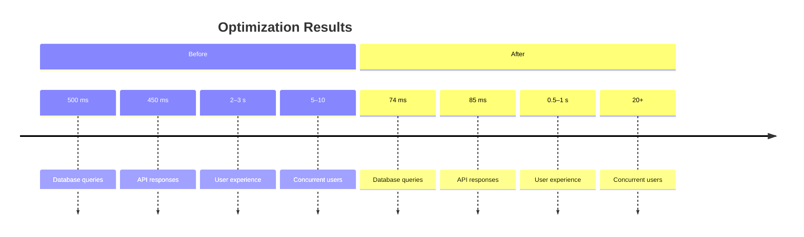

# Computer Science at SJDLS

A full-stack web application built for SJDLS students to learn computer science, prepare for AP CSP, and access CyberPatriot resources — all in one unified platform.

---

## What It Does

- **Course Guides** for PLTW, AP CSP, and CyberPatriot  
- **Interactive Checklists** (AP Create Task + CyberPatriot Windows/Linux tasks)  
- **Learning Resources** (setup guides, practice problems, scholarships, internships)  
- **User Accounts** with Google Sign-In or Email + Password  
- **Interactive Quizzes** with progress tracking and analytics  
- **Performance Dashboard** for students  

---

## Tech Stack

| Area | Tools |
|------|-------|
| **Frontend** | React + Vite + Tailwind + Redux |
| **Backend** | Node.js + Express + MongoDB |
| **Auth / Storage** | Firebase |
| **Hosting** | Vercel (frontend) + Render (backend) + MongoDB Atlas |

---

## Application Preview

### Homepage & Navigation

<table>
  <tr>
    <td align="center"><strong>Homepage (Light Mode)</strong></td>
    <td align="center"><strong>Homepage (Dark Mode)</strong></td>
  </tr>
  <tr>
    <td></td>
    <td></td>
  </tr>
</table>

### Course Resources & Guides

<table>
  <tr>
    <td align="center"><strong>AP CSP Review</strong></td>
    <td align="center"><strong>Git & GitHub Setup</strong></td>
  </tr>
  <tr>
    <td></td>
    <td></td>
  </tr>
</table>

### Interactive Checklists

**AP CSP Create Task Checklist (Dark Mode)**  

### Quiz System & Analytics

<table>
  <tr>
    <td align="center"><strong>Quiz Selection</strong></td>
    <td align="center"><strong>Quiz Interface</strong></td>
  </tr>
  <tr>
    <td></td>
    <td></td>
  </tr>
</table>

### Performance Analytics

**Student Dashboard & Progress Tracking**  

---

## Key Features

### Educational Content
- Comprehensive AP CSP preparation and practice modules  
- CyberPatriot checklists for Windows and Linux security tasks  
- PLTW-aligned course content and resources  
- Centralized library of setup guides, tutorials, and references  

### Interactive Learning
- Dynamic quiz engine with adaptive difficulty  
- 200+ questions across computer science topics  
- Real-time progress analytics for each user  
- Performance trends and class-wide insights  

### User Experience
- Dual authentication (Google OAuth + Email/Password)  
- Light/Dark mode toggle  
- Fully responsive on desktop and mobile  
- Streamlined course navigation  

---

## Target Users

| Group | Use Case |
|--------|-----------|
| **Students** | AP CSP prep, CyberPatriot practice, CS self-study |
| **Teachers** | Progress tracking, analytics dashboard |
| **Coaches** | CyberPatriot team management |
| **Curriculum Leads** | Curriculum performance insights |

---

## Technical Highlights

### Performance Optimizations
| Metric | Before | After | Improvement |
|--------|--------|-------|-------------|
| **Database Queries** | 500 ms | 74 ms | **85% faster** |
| **API Response Time** | 400–500 ms | 69–111 ms | **78–83% faster** |
| **User Experience (Page Loads)** | 2–3 s | 0.5–1 s | **75% faster** |
| **Concurrent Users Supported** | 5–10 | 20+ | **200%+ increase** |

**Optimizations Implemented**
- Compound indexes and optimized aggregation pipelines  
- Use of `.select()`, `.lean()`, `.limit()` for efficient queries  
- Connection pooling and reduced I/O latency  
- Response compression (gzip)  
- Cached frequent endpoints (90–100% cache hit rate)  
- Improved error handling and retry logic  

---

## Real-World Impact

| Category | Task | Before | After | Improvement |
|-----------|-------|--------|--------|-------------|
| **Student** | Quiz load time | 2–3 s | 0.5–1 s | 75% faster |
|  | Question navigation | 1–2 s | 0.1–0.2 s | 90% faster |
|  | Answer submission | 1–2 s | 0.1–0.2 s | 90% faster |
| **Teacher** | Dashboard load | 3–4 s | 0.5–1 s | 75% faster |
|  | Analytics view | 2–3 s | 0.5–1 s | 75% faster |
| **System** | Concurrent users | 5–10 | 20+ | 200%+ increase |
|  | Error rate | 5–10% | <1% | 90% reduction |

---

## Performance Timeline

